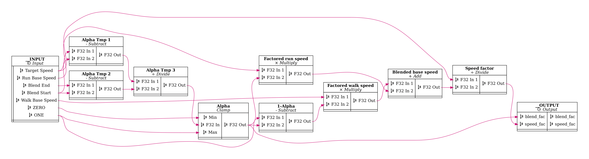

# bevy_animation_graph

## Motivation

Animation graphs are an essential tool for managing the complexity present in
the animation pipelines for modern 3D games. When your game has tens of
animations with complex blends and transitions, or you want to generate
your animations procedurally from very few keyframes, simple animation
clip playback is not enough.

This library aims to fill this gap in the Bevy ecosystem.

## Current Features

- Animation graphs are assets. They can be loaded from asset files, or created in code with an ergonomic API.
- Available nodes:
  - Animation clip playback
  - Animation chaining (i.e. play one node after another)
  - Looping
  - Linear Blending (in bone space)
  - Mirror animation about the YZ plane
  - Arithmetic nodes:
    - F32: Add, Subtract, Multiply, Divide, Clamp.
  - Speed up or slow down animation playback
  - Animation graph node
- Nesting animation graphs as nodes within other graphs.
- Support for custom nodes written in Rust (with the caveat that custom nodes cannot be serialized/deserialized as assets)
- Export animation graphs in graphviz `.dot` format for visualization.
- Output from graph nodes is cached to avoid unnecessary computations.

## Planned Features

In order of priority:

1. More documentation!
1. Finite state machines.
1. More procedural animation nodes:
   1. Apply transform to bone
   2. Two-bone IK
1. Graph editor UI tool
1. Ragdoll and physics integration (inititally `bevy_xpbd`, possibly rapier later):
   1. Using a bone mask to specify which bones are kinematically driven, and which bones are simulated (i.e. _ragdolled_)
   2. Pose matching with joint motors (pending on joint motors being implemented in `bevy_xpbd`, currently WIP)
1. FABRIK node (?).

## Usage

Animation clips are specified with asset files ending in `.anim.ron`. For
example:

```ron
// In file: assets/animations/walk.anim.ron
(
    source: GltfNamed(
        path: "models/character_rigged.gltf",
        animation_name: "Walk",
    ),
)
```

Currently, the only supported source is `GltfNamed`, where the `path` field points to
a gltf asset, and the `animation_name` field contains the name label of the animation.

Animation graphs are stored as `.animgraph.ron` files. See the explained example below and
the code in `examples/human.rs` for how to create, play and interact with
animation graphs.

## Examples

### Locomotion graph

Consider the following scenario:

- Inputs:
  - We have a _partial_ running animation composed of two keyframes: one for the
    reaching pose and one for the passing pose. The animation only covers half of
    a running cycle.
  - We have a _partial_ walk animation similarly composed of two keyframes.
  - We have a target movement speed for the character.
  - We know the movement speeds corresponding to the unmodified walk and run
    animations, which we call `walk_base_speed` and `run_base_speed`.
  - We decide on a range of target speeds where the blend between walk and run
    should happen. We call this `blend_start` and `blend_end`.
- Desired output:
  - A complete movement animation that covers the full walk/run cycle and
    performs a synchronized blend between the walk and run animations based on
    the target speed.

A solution to this problem is as follows:

1. The blend factor between the two animations can be computed as

   ```
   blend_fac = clamp((target_speed - blend_start) / (blend_end - blend_start), 0, 1)
   ```

   The playback speed factor applied to both animations is then

   ```
   speed_fac = target_speed / (walk_base_speed * (1 - blend_fac) + run_base_speed * blend_fac)
   ```

2. We mirror the run animation along the X axis, and chain the result to the
   original run animation to get a complete run cycle. Do the same with the walk
   animation.
3. Blend the two animations together using `blend_fac`. Loop the result and
   apply the speed factor `speed_fac`.

The resulting graph is defined like so:

```ron
// In file assets/animation_graphs/locomotion.animgraph.ron
(
    nodes: [
        (name: "Walk Clip", node: Clip("animations/walk.anim.ron", Some(1.))),
        (name: "Run Clip",  node: Clip("animations/run.anim.ron", Some(1.))),
        (name: "Walk Flip LR", node: FlipLR),
        (name: "Run Flip LR", node: FlipLR),
        (name: "Walk Chain", node: Chain),
        (name: "Run Chain", node: Chain),
        (name: "Blend", node: Blend),
        (name: "Loop", node: Loop),
        (name: "Speed", node: Speed),

        (name: "Param graph", node: Graph("animation_graphs/velocity_to_params.animgraph.ron")),
    ],
    input_parameters: {
        "Target Speed": F32(1.5),
    },
    output_time_dependent_spec: {
        "Pose": PoseFrame,
    },
    input_edges: [
        // Alpha parameters
        ("Target Speed", ("Param graph", "Target Speed")),
    ],
    edges: [
        (("Param graph", "blend_fac"),("Blend", "Factor")),
        (("Param graph", "speed_fac"),("Speed", "Speed")),

        (("Walk Clip", "Pose Out"), ("Walk Flip LR", "Pose In")),
        (("Walk Clip", "Pose Out"), ("Walk Chain", "Pose In 1")),
        (("Walk Flip LR", "Pose Out"), ("Walk Chain", "Pose In 2")),
        (("Run Clip", "Pose Out"), ("Run Chain", "Pose In 1")),
        (("Run Clip", "Pose Out"), ("Run Flip LR", "Pose In")),
        (("Run Flip LR", "Pose Out"), ("Run Chain", "Pose In 2")),
        (("Walk Chain", "Pose Out"), ("Blend", "Pose In 1")),
        (("Run Chain", "Pose Out"), ("Blend", "Pose In 2")),
        (("Blend", "Pose Out"), ("Loop", "Pose In")),
        (("Loop", "Pose Out"), ("Speed", "Pose In")),
    ],
    output_edges: [
        (("Speed", "Pose Out"), "Pose"),
    ],
    default_output: Some("Pose"),
)
```

We have extracted the computation of `blend_fac` and `speed_fac` into a separate
graph that we reference as a node above:

```ron
// In file: assets/animation_graphs/locomotion.ron
(
    nodes: [
        (name: "Alpha Tmp 1", node: SubF32),
        (name: "Alpha Tmp 2", node: SubF32),
        (name: "Alpha Tmp 3", node: DivF32),
        (name: "Alpha", node: ClampF32),

        (name: "1-Alpha", node: SubF32),
        (name: "Factored walk speed", node: MulF32),
        (name: "Factored run speed", node: MulF32),
        (name: "Blended base speed", node: AddF32),
        (name: "Speed factor", node: DivF32),
    ],
    input_parameters: {
        "Walk Base Speed": F32(0.3),
        "Run Base Speed": F32(0.8),
        "Target Speed": F32(1.5),
        "Blend Start": F32(1.0),
        "Blend End": F32(3.0),

        // Constant values
        // TODO: Maybe there should be a better way to handle constant/defaults?
        "ZERO": F32(0.),
        "ONE": F32(1.),
    },
    output_parameter_spec: {
        "speed_fac": F32,
        "blend_fac": F32,
    },
    input_edges: [
        // Alpha clamp range
        ("ZERO", ("Alpha", "Min")),
        ("ONE", ("Alpha", "Max")),

        // Alpha parameters
        ("Target Speed", ("Alpha Tmp 1", "F32 In 1")),
        ("Blend Start", ("Alpha Tmp 1", "F32 In 2")),
        ("Blend End",   ("Alpha Tmp 2", "F32 In 1")),
        ("Blend Start", ("Alpha Tmp 2", "F32 In 2")),

        // Speed factor parameters
        ("ONE", ("1-Alpha", "F32 In 1")),
        ("Walk Base Speed", ("Factored walk speed", "F32 In 1")),
        ("Run Base Speed", ("Factored run speed", "F32 In 1")),
        ("Target Speed", ("Speed factor", "F32 In 1")),
    ],
    edges: [
        // Blend alpha computation
        // ((target_speed - blend_start) / (blend_end - blend_start)).clamp(0., 1.);
        (("Alpha Tmp 1", "F32 Out"), ("Alpha Tmp 3", "F32 In 1")),
        (("Alpha Tmp 2", "F32 Out"), ("Alpha Tmp 3", "F32 In 2")),
        (("Alpha Tmp 3", "F32 Out"), ("Alpha", "F32 In")),

        // Speed factor computation
        // target_speed / (walk_base_speed * (1. - alpha) + run_base_seed * alpha)
        (("Alpha", "F32 Out"),("1-Alpha", "F32 In 2")),
        (("1-Alpha", "F32 Out"),("Factored walk speed", "F32 In 2")),
        (("Alpha", "F32 Out"),("Factored run speed", "F32 In 2")),
        (("Factored walk speed", "F32 Out"), ("Blended base speed", "F32 In 1")),
        (("Factored run speed", "F32 Out"), ("Blended base speed", "F32 In 2")),
        (("Blended base speed", "F32 Out"),("Speed factor", "F32 In 2")),
    ],
    output_edges: [
        (("Alpha", "F32 Out"), "blend_fac"),
        (("Speed factor", "F32 Out"), "speed_fac"),
    ],
)
```

The resulting locomotion graph looks like this:


And the parameter computation graph:


The resulting animation is this ~~_(please forgive the lack or artistic skill)_~~ :

https://github.com/mbrea-c/bevy_animation_graph/assets/31567043/c1a52b6b-fbc9-4c83-ad4e-306071df3903

## Contributing

If you run into a bug or want to suggest a missing feature, feel free to post an issue, open a PR or reach out to me in Discord
(@mbreac in the Bevy discord).

## FAQ

### Is this ready for production?

No. The library is still in a very early stage, and there is likely to be bugs, missing features, performance issues and API breakage as I iron
out the kinks in the coming months.
However, it has reached the point where it is useful and stable enough that I've started to integrate it into my game, and it may be useful to you
for small-ish projects or game jams.

## Acknowledgements

Many thanks to [Bobby Anguelov](https://www.youtube.com/@BobbyAnguelov) for his lectures on animation programming.
