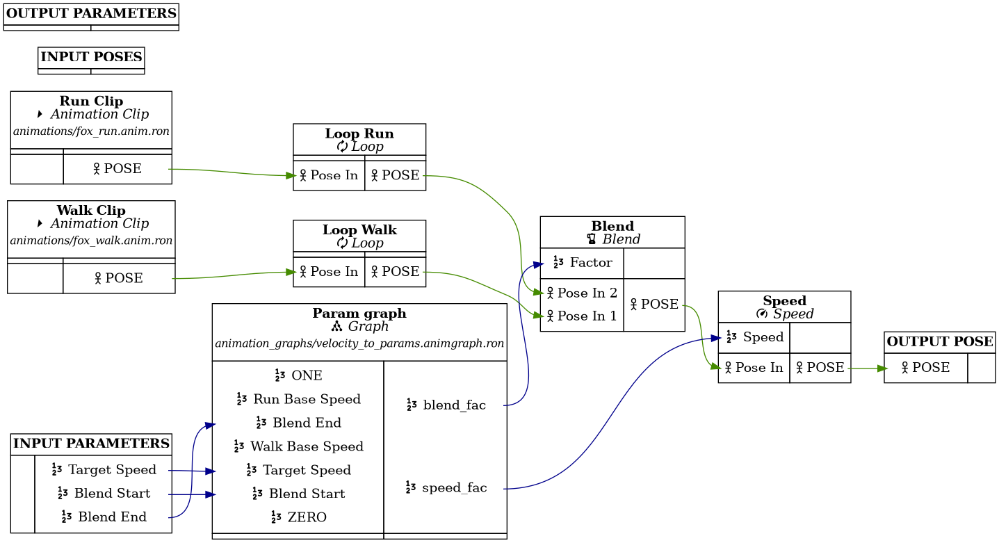

 
 
[](https://github.com/mbrea-c/bevy_animation_graph/actions/workflows/ci.yaml)

# Bevy Animation Graph

## Motivation

Animation graphs are an essential tool for managing the complexity present in
the animation pipelines for modern 3D games. When your game has tens of
animations with complex blends and transitions, or you want to generate
your animations procedurally from very few keyframes, simple animation
clip playback is not enough.

This crate works as a replacement to most of `bevy_animation`, and aims to
provide a complete animation system and development workflow including
animation graphs, animation state machines (i.e. animation controllers)
and a graphical editor to create your animation graphs and state machines. 

_NOTE: This project is separate from the animation graphs introduced in `bevy_animation`
in version 0.14._

## Current Features

- Animation graphs are assets. They can be loaded from asset files, or created in code with an ergonomic API.
- Visual graph editor.
- Animation state machines:
  - Animation state machines are embedded as nodes in animation graphs.
  - Each state in a state machines plays back its own animation graph on demand.
  - Transitions also have their own animation graph, and they can query source
    and target states' animation graphs.
- Available nodes:
  - Animation chaining (i.e. play one node after another).
  - Two-bone inverse kinematics.
  - Looping.
  - Linear Blending (in bone space).
  - Mirror animation about the YZ plane.
  - Animation clip playback.
  - Apply a given rotation to some bones in a pose using a bone mask.
  - Arithmetic nodes:
    - F32: Add, Subtract, Multiply, Divide, Clamp.
    - Vec3: Rotation arc.
  - Speed up or slow down animation playback.
  - Animation graph node.
  - Animation state machine node.
- Nesting animation graphs as nodes within other graphs.
- Output from graph nodes is cached to avoid unnecessary computations.
- Support for custom nodes written in Rust (with the caveat that custom nodes cannot be serialized/deserialized as assets).

## Planned Features

Being worked on:

1. Synchronization tracks.

Wishlist:

1. Ragdoll and physics integration (inititally `bevy_xpbd`, possibly rapier later):
   1. Using a bone mask to specify which bones are kinematically driven, and which bones are simulated (i.e. _ragdolled_)
   2. Pose matching with joint motors (pending on joint motors being implemented in `bevy_xpbd`, currently WIP)
1. FABRIK node (?).

## Installation

This project is divided in two crates:

- [bevy_animation_graph](https://crates.io/crates/bevy_animation_graph) is the
  library part of this project. This should be added as a dependency to your
  project in order to use animation graphs. To install the latest published version from crates.io run

  ```bash
  cargo add bevy_animation_graph
  ```

  or manually add the latest version to your `Cargo.toml`.

  To install the latest git master, add the following to `Cargo.toml`

  ```toml
  # ...
  [dependencies]
  # ...
  bevy_animation_graph = { git = "https://github.com/mbrea-c/bevy_animation_graph.git" }
  # ...
  ```

- [bevy_animation_graph_editor](https://crates.io/crates/bevy_animation_graph_editor)
  is the editor. You can install like you would install any other rust binary:

  ```bash
  # for the latest crates.io version
  cargo install bevy_animation_graph_editor
  # for the latest master
  cargo install --git https://github.com/mbrea-c/bevy_animation_graph bevy_animation_graph_editor
  # for the version from a local workspace
  cargo install --path <PATH_TO_WORKSPACE> bevy_animation_graph_editor

  # use the --force flag to force reinstall
  ```

## Version table

| `bevy` | `bevy_animation_graph` | `bevy_animation_graph_editor` |
| ------ | ---------------------- | ----------------------------- |
| 0.13   | 0.4                    | 0.4                           |
| 0.13   | 0.3                    | 0.3                           |
| 0.12   | 0.2                    | 0.2                           |

## Usage and examples

The documentation in [docs.rs](https://docs.rs/bevy_animation_graph) contains an
introduction of the library and editor and an explanation of a simple animation graph example.
See also the video below for a demonstration of editor usage.

Examples are included in the [examples](examples/) directory.

### Screenshots



### Editor usage demonstration video

**NOTE: This video was taken with the last version of the crate. A lot has
changed since then!**

In YouTube:

[](https://www.youtube.com/watch?v=q-JBSQJIcX0)

## Contributing or getting help

If you run into a bug or want to discuss potential new features, feel free to post an issue, open a PR or reach out to me in Discord
(@mbreac in the Bevy discord, there's a crate-help post for `bevy_animation_graph` there: [link](https://discord.com/channels/691052431525675048/1202998277482479616)).

## FAQ

### Is this ready for production?

Depends.

It can already be useful for small-ish projects, but I cannot guarantee
API stability between different `0.x` versions (it is a big library, it is
relatively young and I don't have previous experience with animation programming,
so I'm still figuring out the best ways of doing things).
This means that it will likely be necessary to go into your animation graph
assets and manually migrate them between versions, at least until I find a
better way to handle migrations.

Additionally, there ~~may~~ will be bugs and other issues. I try to get them
fixed as they come up.

### Will you implement feature X?

If it's a small feature (e.g. some additional vector or floating point
arithmetic node) it's likely that I have just not got around to it. If you
open an issue I will probably implement it quickly. PRs are also welcome.

For larger features, it's better to start by opening an issue for discussion or
pinging me in the Bevy discord.

## Acknowledgements

Many thanks to [Bobby Anguelov](https://www.youtube.com/@BobbyAnguelov) for his lectures on animation programming.
