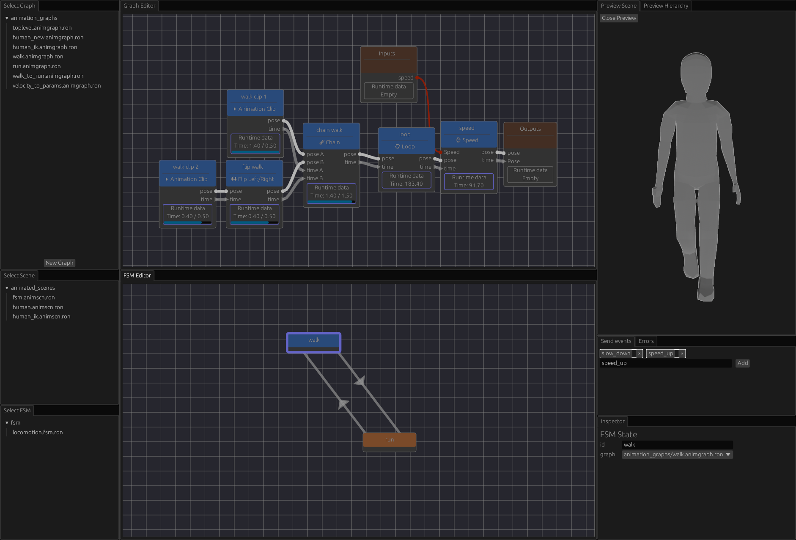

 
[](https://github.com/mbrea-c/bevy_animation_graph/actions/workflows/ci.yaml)

# Bevy Animation Graph

## Motivation

Animation graphs are an essential tool for managing the complexity present in
the animation pipelines for modern 3D games. When your game has tens of
animations with complex blends and transitions, or you want to generate
your animations procedurally from very few keyframes, simple animation
clip playback is not enough.

This library aims to fill this gap in the Bevy ecosystem.

## Current Features

- Animation graphs are assets. They can be loaded from asset files, or created in code with an ergonomic API.
- Available nodes:
  - Animation clip playback
  - Animation chaining (i.e. play one node after another)
  - Looping
  - Linear Blending (in bone space)
  - Mirror animation about the YZ plane
  - Arithmetic nodes:
    - F32: Add, Subtract, Multiply, Divide, Clamp.
  - Speed up or slow down animation playback
  - Animation graph node
- Nesting animation graphs as nodes within other graphs.
- Support for custom nodes written in Rust (with the caveat that custom nodes cannot be serialized/deserialized as assets)
- Export animation graphs in graphviz `.dot` format for visualization.
- Output from graph nodes is cached to avoid unnecessary computations.

## Planned Features

In order of priority:

1. Finite state machines.
1. More procedural animation nodes:
   1. Apply transform to bone
   2. Two-bone IK
1. Graph editor UI tool
1. Ragdoll and physics integration (inititally `bevy_xpbd`, possibly rapier later):
   1. Using a bone mask to specify which bones are kinematically driven, and which bones are simulated (i.e. _ragdolled_)
   2. Pose matching with joint motors (pending on joint motors being implemented in `bevy_xpbd`, currently WIP)
1. FABRIK node (?).

## Installation

This library is [available in crates.io](https://crates.io/crates/bevy_animation_graph). To install the latest published version run

```bash
cargo add bevy_animation_graph
```

or manually add the latest version to your `Cargo.toml`.

To install the latest git master, add the following to `Cargo.toml`

```toml
# ...
[dependencies]
# ...
bevy_animation_graph = { git = "https://github.com/mbrea-c/bevy_animation_graph.git" }
# ...
```

## Usage and examples

The documentation in [docs.rs](https://docs.rs/bevy_animation_graph) contains an
introduction of the library and an explanation of a locomotion animation graph example.

The complete example is also included in [examples/human.rs](examples/human.rs).

The resulting locomotion graph looks like this:


And the parameter computation graph:


The resulting animation is this:

https://github.com/mbrea-c/bevy_animation_graph/assets/31567043/c1a52b6b-fbc9-4c83-ad4e-306071df3903

## Contributing

If you run into a bug or want to suggest a missing feature, feel free to post an issue, open a PR or reach out to me in Discord
(@mbreac in the Bevy discord).

## FAQ

### Is this ready for production?

No. The library is still in a very early stage, and there is likely to be bugs, missing features, performance issues and API breakage as I iron
out the kinks in the coming months.
However, it has reached the point where it is useful and stable enough that I've started to integrate it into my game, and it may be useful to you
for small-ish projects or game jams.

## Acknowledgements

Many thanks to [Bobby Anguelov](https://www.youtube.com/@BobbyAnguelov) for his lectures on animation programming.
